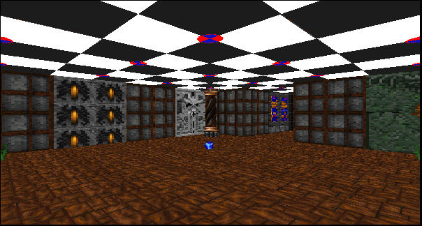

# 2002_DOS_3D_raytracing_game

Ray tracing based game engine (similar to wolfenstein game engine), 32-bit MS-DOS

The game was written for the MS-DOS platform in TMT Pascal 32-bit. The graphics mode is SVGA with a resolution of 800x600 and 256 colors. The engine is based on ray tracing on the 2D map and then rendering the texture column like in Wolfenstein and Doom games. The inner loop is optimized in assembler for the 80486 processor, on which the engine at 800x600 resolution works with sufficient performance. Graphical assets are obtained from RAM dumps of the game Heretic.

*Read this in other languages: [English](README.md), [Русский](README.ru.md)

There are some screenshots if a gameplay:

# Table of contents
- [Installation](#Installation)
- [Brief description of the game](#Brief-description-of-the-game)
- [Play in browser](#Play-in-browser)

# Installation

To start the game, just download the ray-tr.zip file, unpack the archive and run proba.exe, preferably in DosBox.

Or you can play online in a browser using the js-dos emulator [Play in browser](#Play-in-browser) Unfortunately, in a browser emulator (unlike real hardware), the program works with poor performance.

To compile from sources (code folder), you must use the TMT Pascal compiler

# Brief description of the game

You can walk around the map (use the arrow keys to control), open doors (space), collect items. Also there is a level editor in the archive.

# Play in browser

Using the link below, you can try the game in the browser, through the js-dos emulator

[Play](https://andrey-andrianov.github.io/sites/jsdos/ray.html)

For more convenient control from mobile devices, the most frequently used keys have been added to the screen. They can be hidden or shown from the DosBox control panel on the left. Also, to run on mobile devices, it is convenient to add a web page to the home screen of the device.
