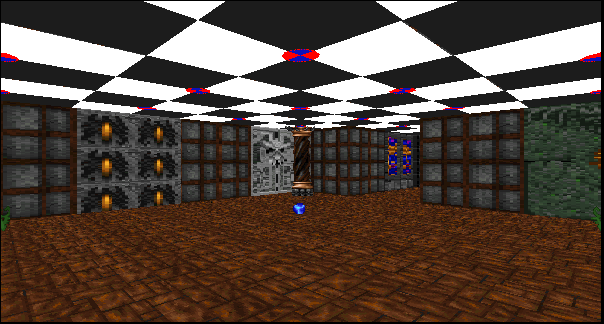

# 2002_DOS_3D_raytracing_game

Движок игры написан для платформы MS-DOS на языке TMT Pascal 32-bit. Используются графический режим SVGA с разрешением 800х600 и с 256 цветами. 

* Читать на других языках: [English](README.md), [Русский](README.ru.md)

Скриншоты геймплея:

# Оглавление
- [Установка](#Установка)
- [Краткое описание игры](#Краткое-описание-игры)
- [Играть в браузере](#Играть-в-браузере)

# Установка

Для начала игры достаточно скачать файл ray-tr.zip, распаковать архив и запустить proba.exe, желательно в DosBox.

Либо можно играть онлайн в браузере через эмулятор js-dos [Играть в браузере](#Играть-в-браузере)

Для компиляции из исходников (папка code) необходимо использовать компилятор TMT Pascal

# Краткое описание игры

# Играть в браузере

По ссылке ниже можно попробовать игру в браузере, через эмулятор js-dos

[Играть](https://andrey-andrianov.github.io/sites/jsdos/ray-tr.html)
